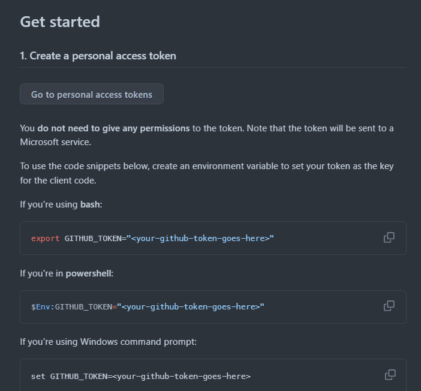
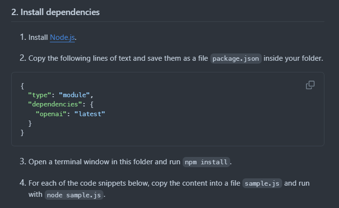

<center>




</center>

#### Example 1

```javascript
import OpenAI from 'openai';

const token = process.env['GITHUB_TOKEN'];
const endpoint = 'https://models.inference.ai.azure.com';
const modelName = 'gpt-4o-mini';

export async function main() {
  const client = new OpenAI({ baseURL: endpoint, apiKey: token });

  const response = await client.chat.completions.create({
    messages: [
      { role: 'system', content: 'You are a helpful assistant.' },
      { role: 'user', content: 'What is the capital of France?' },
    ],
    model: modelName,
    temperature: 1,
    max_tokens: 1000,
    top_p: 1,
  });

  console.log(response.choices[0].message.content);
}

main().catch(err => {
  console.error('The sample encountered an error:', err);
});
```

#### Example 2

```javascript
import OpenAI from 'openai';

const token = process.env['GITHUB_TOKEN'];
const endpoint = 'https://models.inference.ai.azure.com';
const modelName = 'gpt-4o-mini';

function getFlightInfo({ originCity, destinationCity }) {
  if (originCity === 'Seattle' && destinationCity === 'Miami') {
    return JSON.stringify({
      airline: 'Delta',
      flight_number: 'DL123',
      flight_date: 'May 7th, 2024',
      flight_time: '10:00AM',
    });
  }
  return JSON.stringify({ error: 'No flights found between the cities' });
}

const namesToFunctions = {
  getFlightInfo: data => getFlightInfo(data),
};

export async function main() {
  const tool = {
    type: 'function',
    function: {
      name: 'getFlightInfo',
      description:
        'Returns information about the next flight between two cities.' +
        'This includes the name of the airline, flight number and the date and time' +
        'of the next flight',
      parameters: {
        type: 'object',
        properties: {
          originCity: {
            type: 'string',
            description: 'The name of the city where the flight originates',
          },
          destinationCity: {
            type: 'string',
            description: 'The flight destination city',
          },
        },
        required: ['originCity', 'destinationCity'],
      },
    },
  };

  const client = new OpenAI({ baseURL: endpoint, apiKey: token });

  let messages = [
    { role: 'system', content: 'You an assistant that helps users find flight information.' },
    { role: 'user', content: "I'm interested in going to Miami. What is the next flight there from Seattle?" },
  ];

  let response = await client.chat.completions.create({
    messages: messages,
    tools: [tool],
    model: modelName,
  });

  // We expect the model to ask for a tool call
  if (response.choices[0].finish_reason === 'tool_calls') {
    // Append the model response to the chat history
    messages.push(response.choices[0].message);

    // We expect a single tool call
    if (response.choices[0].message && response.choices[0].message.tool_calls.length === 1) {
      const toolCall = response.choices[0].message.tool_calls[0];
      // We expect the tool to be a function call
      if (toolCall.type === 'function') {
        const toolCall = response.choices[0].message.tool_calls[0];
        // Parse the function call arguments and call the function
        const functionArgs = JSON.parse(toolCall.function.arguments);
        console.log(`Calling function \`${toolCall.function.name}\` with arguments ${toolCall.function.arguments}`);
        const callableFunc = namesToFunctions[toolCall.function.name];
        const functionReturn = callableFunc(functionArgs);
        console.log(`Function returned = ${functionReturn}`);

        // Append the function call result fo the chat history
        messages.push({
          tool_call_id: toolCall.id,
          role: 'tool',
          name: toolCall.function.name,
          content: functionReturn,
        });

        response = await client.chat.completions.create({
          messages: messages,
          tools: [tool],
          model: modelName,
        });
        console.log(`Model response = ${response.choices[0].message.content}`);
      }
    }
  }
}

main().catch(err => {
  console.error('The sample encountered an error:', err);
});
```

#### Example 3

```javascript
import OpenAI from 'openai';

const token = process.env['GITHUB_TOKEN'];
const endpoint = 'https://models.inference.ai.azure.com';
const modelName = 'gpt-4o-mini';

export async function main() {
  const client = new OpenAI({ baseURL: endpoint, apiKey: token });

  const response = await client.chat.completions.create({
    messages: [
      { role: 'system', content: 'You are a helpful assistant.' },
      { role: 'user', content: 'What is the capital of France?' },
      { role: 'assistant', content: 'The capital of France is Paris.' },
      { role: 'user', content: 'What about Spain?' },
    ],
    model: modelName,
  });

  console.log(response.choices[0].message.content);
}

main().catch(err => {
  console.error('The sample encountered an error:', err);
});
```

#### Example 4

```javascript
import OpenAI from 'openai';

const token = process.env['GITHUB_TOKEN'];
const endpoint = 'https://models.inference.ai.azure.com';
const modelName = 'gpt-4o-mini';

export async function main() {
  const client = new OpenAI({ baseURL: endpoint, apiKey: token });

  const response = await client.chat.completions.create({
    messages: [
      { role: 'system', content: 'You are a helpful assistant.' },
      { role: 'user', content: 'What is the capital of France?' },
      { role: 'assistant', content: 'The capital of France is Paris.' },
      { role: 'user', content: 'What about Spain?' },
    ],
    model: modelName,
  });

  console.log(response.choices[0].message.content);
}

main().catch(err => {
  console.error('The sample encountered an error:', err);
});
```

#### Example 5

```javascript
import OpenAI from 'openai';

const token = process.env['GITHUB_TOKEN'];
const endpoint = 'https://models.inference.ai.azure.com';
const modelName = 'gpt-4o-mini';

export async function main() {
  const client = new OpenAI({ baseURL: endpoint, apiKey: token });

  const stream = await client.chat.completions.create({
    messages: [
      { role: 'system', content: 'You are a helpful assistant.' },
      { role: 'user', content: 'Give me 5 good reasons why I should exercise every day.' },
    ],
    model: modelName,
    stream: true,
  });

  for await (const part of stream) {
    process.stdout.write(part.choices[0]?.delta?.content || '');
  }
  process.stdout.write('\n');
}

main().catch(err => {
  console.error('The sample encountered an error:', err);
});
```
